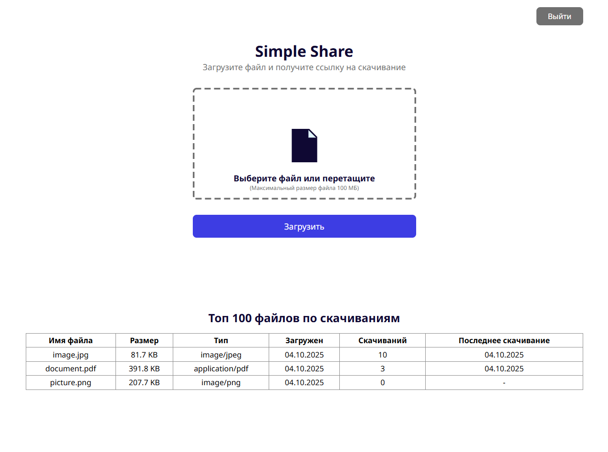

# 📦 Simple Share

**Simple Share** — это лёгкий web-сервис для загрузки и распространения файлов.
Просто загружаете файл → получаете ссылку для скачивания → делитесь ею.

## ✨ Возможности

- 🔐 Авторизация пользователей с JWT и cookies
- 📂 Загрузка файлов до 100 МБ
- 📊 Просмотр статистики по файлам (только для администратора)
- 🖥 Удобный web-интерфейс


## 📷 Демонстрация



## 🚀 Установка и запуск

1. Клонируйте репозиторий
```bash
git clone https://github.com/yourname/simple-share.git
cd simple-share
```
2. Установите зависимости
```bash
npm install
```
3. Вы можете настроить окружение, создав файл .env в корне проекта<br>
Параметры окружения по умолчанию:
```.env
PORT=3000
JWT_SECRET=secret
ADMIN_EMAIL=admin@example.com
RETENTION_DAYS=30
BASE_URL=http://localhost:3000
```
4. Запуск сервера
```bash
npm start
```

## 📜 Лицензия
MIT License © 2025
